# Graphical Gems in the agridat Package

The `agridat` package is an extensive collection of data sets that have
been previously published in books and journals, primarily from
agricultural experiments.

This vignette presents graphical views of a few of the datasets in this
package.

## Setup

This exhibit of agricultural data uses the following packages:
`agridat`, `desplot`, `gge`, `HH`, `lattice`, `latticeExtra`, `mapproj`,
`maps`, `reshape2`.

## Potato blight incidence over space and time

    ## Loading required package: desplot

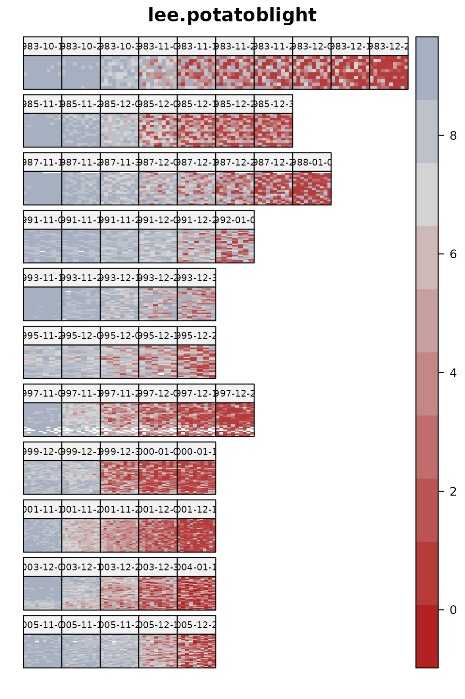

@lee2009random analyzed a large dataset to evaluate the resistance of
potato varieties to blight. This data contains evaluations of a changing
set of varieties every two years, evaluated in 5 blocks, repeatedly
throughout the growing season to track the progress of the disease. Each
panel shows a field map on the given date, with a separate row of panels
for each year.

Would you include field spatial trends in a model for these data?

    ## Loading required package: latticeExtra

    ## Loading required package: lattice

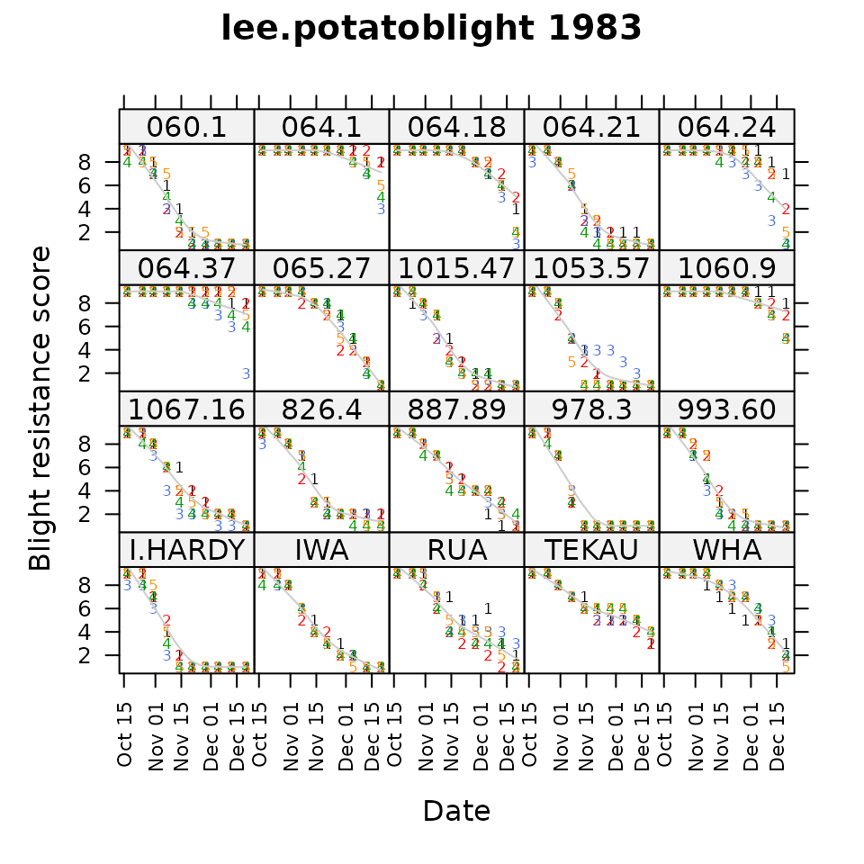

In 1983, 20 varieties were evaluated in 5 blocks (shown by colored
numbers) throughout the growing season for disease resistance.
Resistance scores start at 9 for all varieties (shown in panels). As the
growing season progresses, the ‘I.HARDY’ variety succumbs quickly to
blight, while ‘IWA’ succumbs steadily, and ‘064.1’ resists blight until
near the end of the season.

Does this view show differences between blocks?

## An informative prior

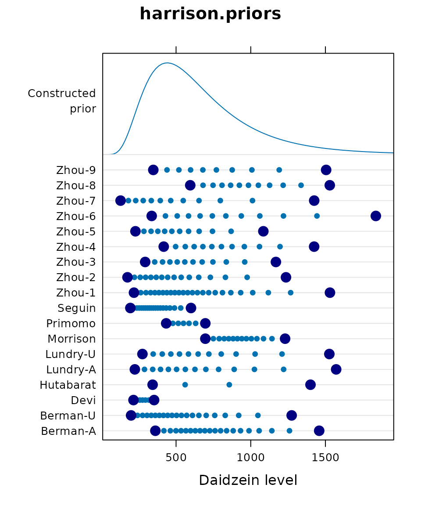

@harrison2012bayesian used a Bayesian approach to model daidzein levels
in soybean samples. From 18 previous publications, they extracted the
published minimum and maximum daidzein levels, and the number of samples
tested. Each line in the dotplot shows large, dark dots for one
published minimum and maximum. The small dots are imputed using a
lognormal distribution.

All observed/imputed data were then used to fit a common lognormal
distribution that can be used as an informative prior. The common prior
is shown by the density at the top of the dotplot.

Do you think it is better to use a non-informative prior, or this
informative prior?

## Data densities for a binomial GLM

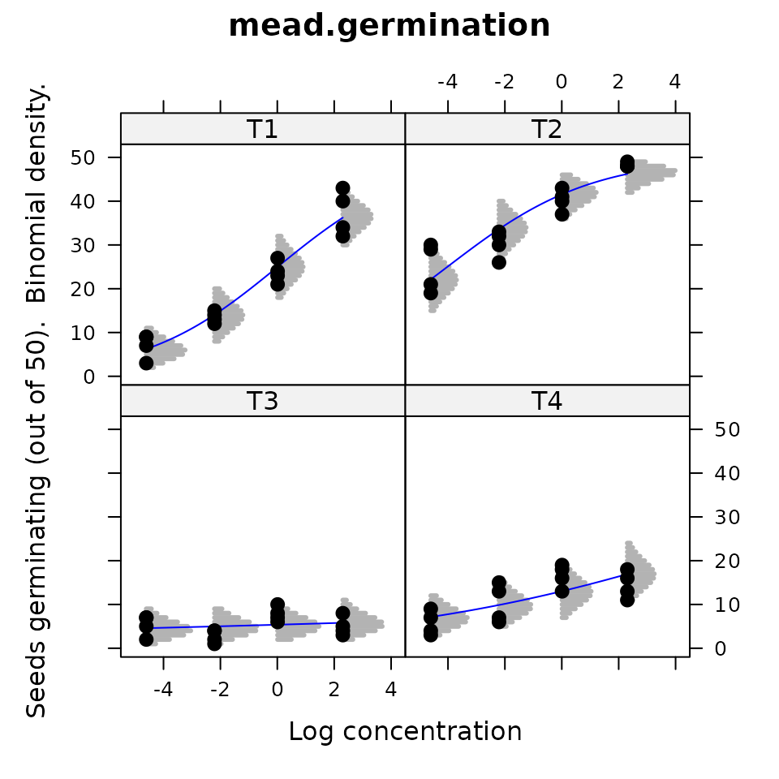

@mead2002statistical present data for germination of seeds under four
temperatures (T1-T4) and four chemical concentrations. For each of the
4\*4=16 treatments, 50 seeds were tested in each of four reps. In the
graphic, each point is one rep. The blue line is a fitted curve from a
GLM with Temperature as a factor and log concentration as a covariate.
The gray lines show the central 95 percent of the binomial density at
that position.

Does this display help you understand the logit link and changing shape
of the binomial density?

## Verification of experiment layout

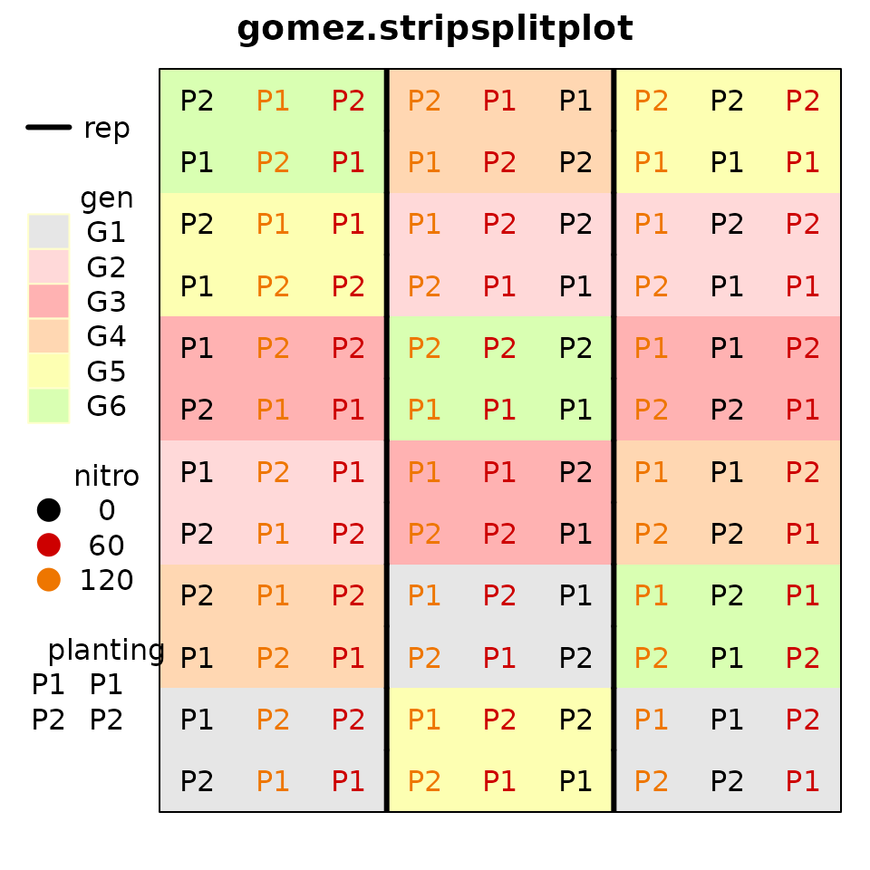

@gomez1984statistical provide data for an experiment with 3 reps, 6
genotypes, 3 levels of nitrogen and 2 planting dates. The experiment
layout is putatively a ‘’split strip-plot’’. To verify the design, the
`desplot` package is used for plotting the design of field experiments.

How is the design different from a ‘’split-split-plot’’ design?

## Visualizing main effects, two-way interactions

    ## Loading required package: HH

    ## Loading required package: grid

    ## Loading required package: multcomp

    ## Loading required package: mvtnorm

    ## Loading required package: survival

    ## Loading required package: TH.data

    ## Loading required package: MASS

    ## 
    ## Attaching package: 'TH.data'

    ## The following object is masked from 'package:MASS':
    ## 
    ##     geyser

    ## Loading required package: gridExtra

    ## 
    ## Attaching package: 'HH'

    ## The following object is masked from 'package:base':
    ## 
    ##     is.R

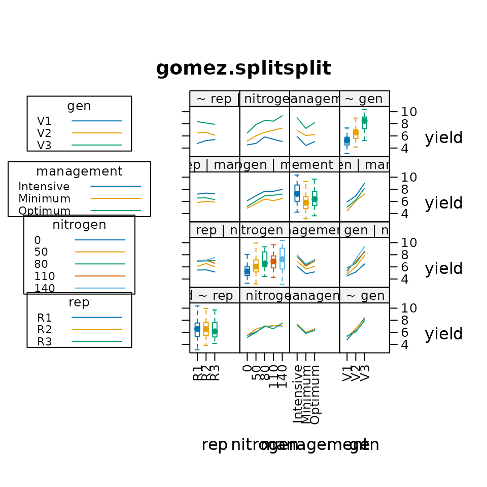

@heiberger2004statistical provide an interesting way to use lattice
graphics to visualize the main effects (using boxplots) and interactions
(using interaction plots) in data. Rice yield is plotted versus
replication, nitrogen, management type, and genotype variety. Box plots
show minor differences between reps, increaing yield due to nitrogen,
high yield from intensive management, and large differences between
varieties.

Do you think interaction plots show interaction (lack of parallelism)?

## 3D yield response to fertilizers

Note: This image was created by manual manipulation of an `rgl` device.
The manual manipulation makes this non-reproducible in an `Rmd` file.
See the example for the `sinclair.clover` data for the code.

@sinclair1994sulphur examined clover yields as a function of sulfur and
phosphorous fertilizer in a factorial-treatment experiment.
@dodds1996bivariate modeled the yield response using a Mitzerlisch-like
equation that allows interacting curvature in two dimensions $x$ and
$y$:
$$yield = \alpha*\left( 1 + \beta*\left( \frac{\sigma + \tau*x}{x + 1} \right)^{y} \right)*\left( 1 + \delta*\left( \frac{\theta + \rho*y}{y + 1} \right)^{x} \right)$$

The blue dots are observed data, and the tan surface is the fitted
surface drawn by the `rgl` package).

How would you decide the optimal fertilizer levels?

## Mosaic plot of potato damage from harvesting

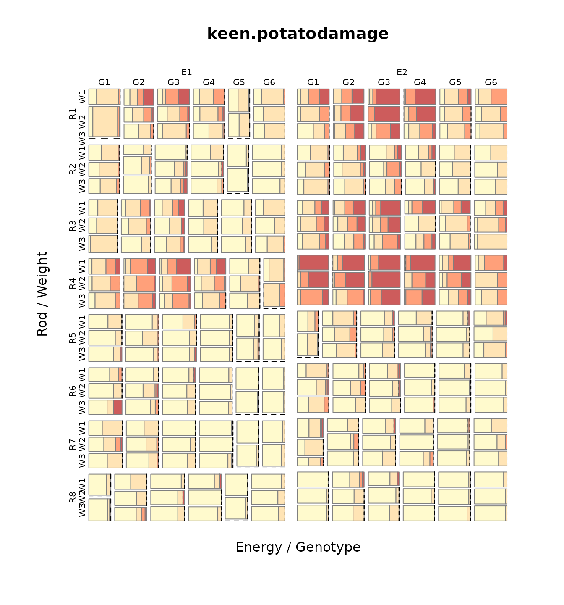

@keen1997analysis looked at damage to potatoes caused by lifting rods
during harvest. In this experiment, eight types of lifting rods were
compared. Two energy levels, six genotypes and three weight classes were
used. For each combinations of treatments, about 20 potato tubers were
rated as undamaged (D1, yellow) to severely damaged (D4, red). Counts
per treatment are shown in a mosaic plot.

Which style of lifting rods cause the least/most damage to potatoes?

## Yield vs covariate for lattice::barley

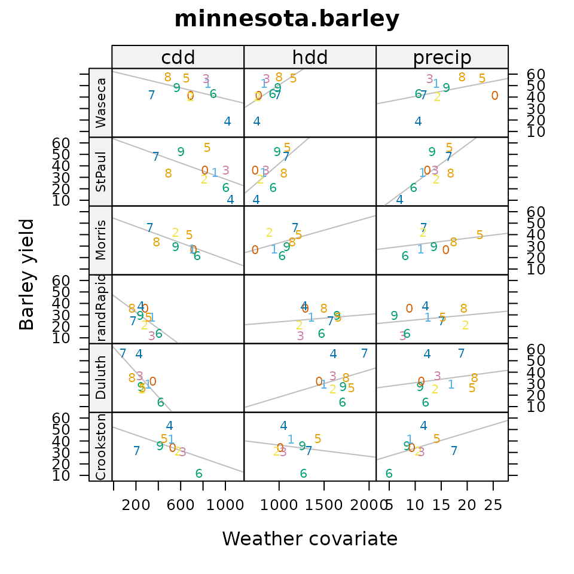

@wright2013revisiting investigated the
[`lattice::barley`](https://rdrr.io/pkg/lattice/man/barley.html) data.
The original two years of data were extended to 10 years (from original
source documents), and supplemented with weather covariates for the 6
locations and 10 years. Each panel shows a scatterplot and regression
for average location yield verses the weather covariate. Horizontal
strips are for locations, vertical strips are for covariates: cdd =
Cooling Degree Days, hdd = Heating Degree Days, precip = Precipitation).
Higher values of heating imply cooler weather. Each plotting symbol is
the last digit of the year (1927-1936) for that location.

Does barley yield better in cooler or warmer weather?

## GGE biplot

@laffont2013genotype developed a variation of the GGE (genotype plus
genotype-by-environment) biplot to include auxiliary information about a
block/group of environments. Each location is classified into one of two
mega-environments (colored). The mosaic plots partition variation
simultaneously by principal component axis and source (genotype,
genotype-by-block, residual).

Which genotypes are best to each mega-environment?

## Nebraska farming income choropleth

    ## Loading required package: maps

    ## Loading required package: mapproj

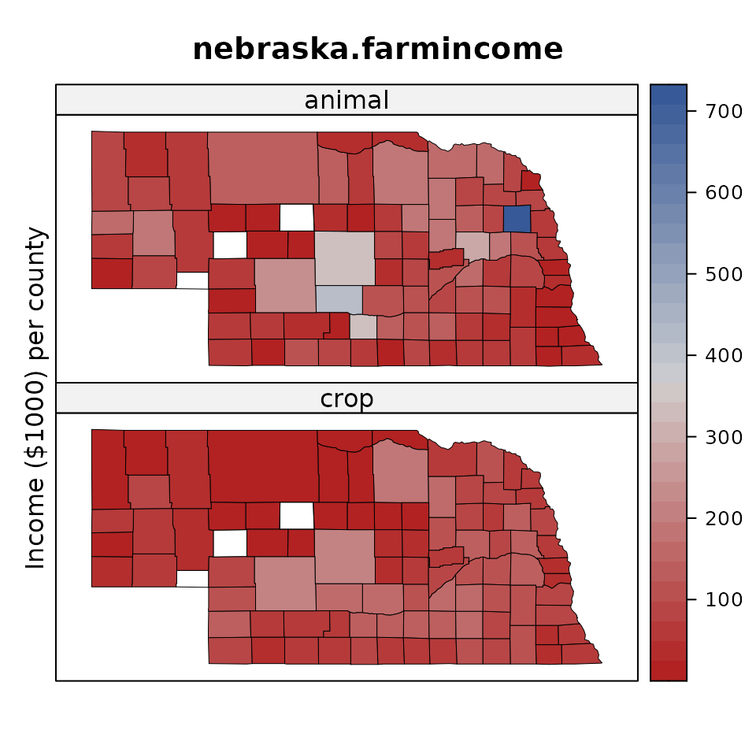

The Red-Blue palette in the `RColorBrewer` package is a divergent
palette with light colors near the middle of the scale. This can cause
problems when there are missing values, which appear as white
(technically, the background). In order to increase the visibility of
missing values, the `agridat` package uses a Red-Gray-Blue palette, with
a gray color that is dark enough to clearly distinguish missing values.

How does the outlier county (Butler) in northeast Nebraska limit
interpration of spatial patterns in the data?

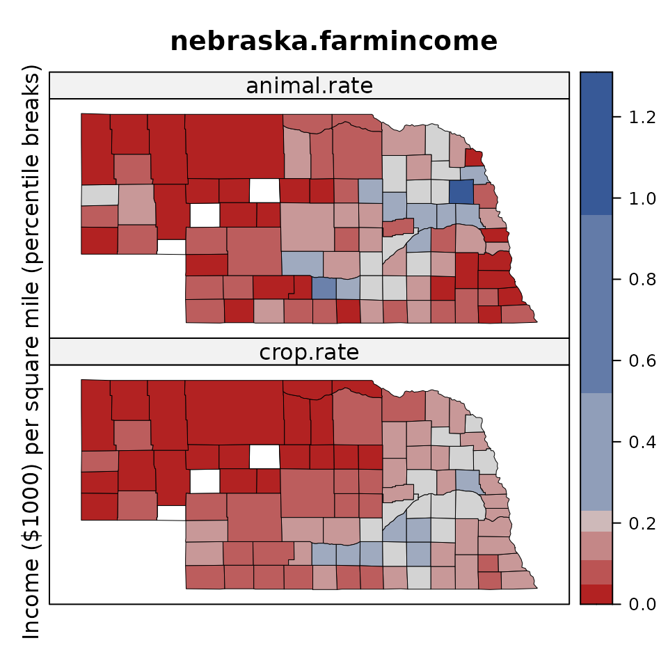

Because counties are different sizes, the second graphic uses an income
rate per square mile. Because of the outlier, it might be smart to use
percentile break points, but doing so hides the outlier. Instead, the
break points are calculated using a method called Fisher-Jenks. These
break points show both the outlier and the spatial patterns. It is now
easy to see that northwest (Sandhills) Nebraska has low farming income,
especially for crops. Counties with missing data are white, which is
easily distinguished from gray.

Where are farm incomes highest? Why?

## Las Rosas yield monitor

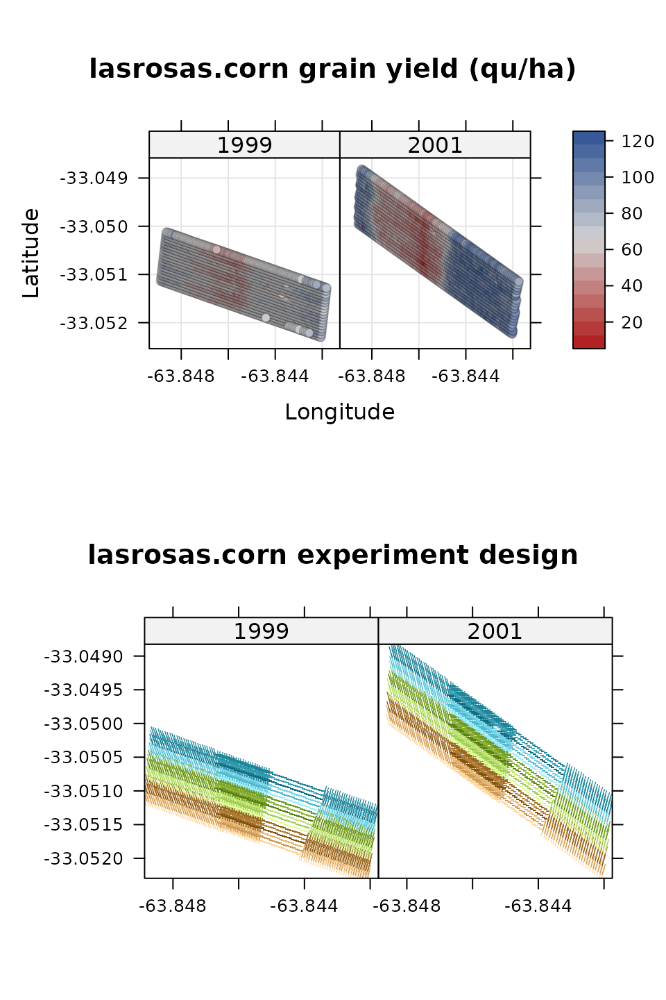

@anselin2004spatial and @lambert2004comparison looked at yield monitor
data collected from a corn field in Argentina in 1999 and 2001, to see
how yield was affected by field topography and nitrogen fertilizer. The
figures here show heatmaps for the yield each year, and also the
experiment design (colors are reps, shades of color are nitrogen level,
plotting character is topography).

Which year showed greater spatial variation in yield?

## Time series of corn yields by state

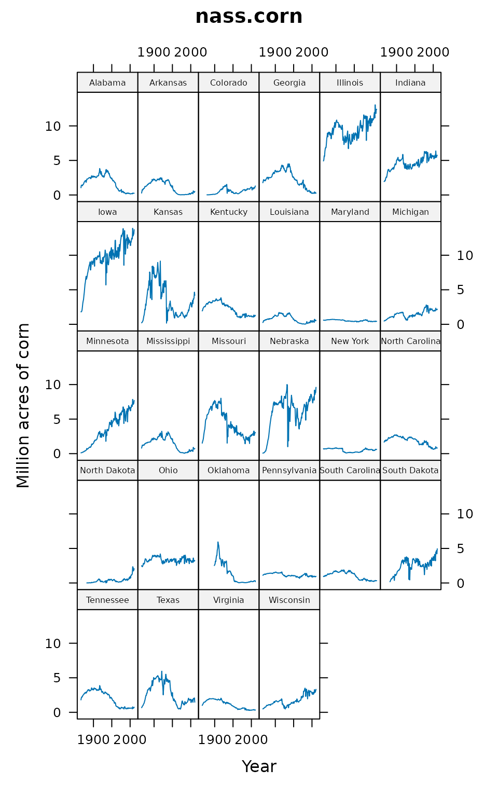

The National Agricultural Statistics Service tracks the total number of
acres planted to corn (and other crops) for each state in the U.S. There
are large changes over the past century in corn acreage for selected
states.

Which states were in the corn belt in 1925?

Which states were in the corn belt in 2000?

## References
