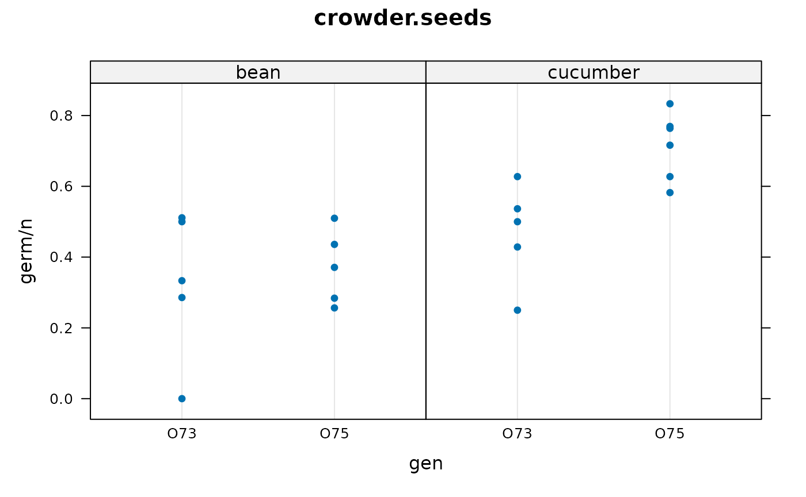

# Example generalized linear mixed model analysis with different packages

``` r
library(agridat)
data(crowder.seeds)
dat <- crowder.seeds
```

``` r
libs(lattice)
dotplot(germ/n~gen|extract, dat, main="crowder.seeds", xlab="gen")
```



The response variable on the vertical axis is the germination percent.

There are two predictive factors, `gen` (O73, O75) and `extract`
(bean/cucumber).

Each dot is for a separate plate.

## GLM (not mixed–no random plate)

#### brms

It takes a minute or so to compile Stan program…

Note, in Emacs brms ends the R process for some reason!

``` r
if(require(brms)){
  m1.brms <- brms::brm( germ|trials(n)~ gen*extract,
     data = dat,
     family = binomial,
     chains=3, iter=3000, warmup=1000)
  summary(m1.brms)
  # round(  summary(m1.brms)$fixed[,1:4] , 2)
  #                        Estimate Est.Error l-95% CI u-95% CI
  # Intercept                 -0.42      0.18    -0.77    -0.06
  # genO75                    -0.14      0.22    -0.56     0.29
  # extractcucumber            0.55      0.25     0.07     1.05
  # genO75:extractcucumber     0.77      0.30     0.18     1.36
}
```

#### glm

``` r
# ----- GLM.
# family=binomial() fixes dispersion at 1
# family=quasibinomial() estimates dispersion, had larger std errors
m1.glm <- glm(cbind(germ,n-germ) ~ gen*extract,
              data=dat,
              #family="binomial",
              family=quasibinomial()
              )
summary(m1.glm) 
## round(summary(m1.glm)$coef,2)
##                        Estimate Std. Error t value Pr(>|t|)
## (Intercept)               -0.41       0.25   -1.64     0.12
## genO75                    -0.15       0.30   -0.48     0.64
## extractcucumber            0.54       0.34    1.58     0.13
## genO75:extractcucumber     0.78       0.42    1.86     0.08
```

#### rstan

``` r
  # ----- Stan using pre-built models from rstanarm
  libs(tidyverse, rstan, rstanarm,bayesplot)
  set.seed(42)
  m1.stan <- stan_glm( cbind(germ,n-germ) ~ gen*extract,
                      data=dat,
                      family = binomial(link="logit")  )
  summary(m1.stan)
  ## round(posterior_interval(m1.stan, prob=.90),3)
  #                            5%    95%
  # (Intercept)            -0.728 -0.115
  # genO75                 -0.506  0.243
  # extractcucumber         0.133  0.947
  # genO75:extractcucumber  0.255  1.267

  libs(bayesplot)
  mcmc_areas(m1.stan, prob = 0.9) +
    ggtitle("Posterior distributions",
            "with medians and 95 pct intervals")
```

## Generalized Linear Mixed Model

#### asreml

``` r
if(require(asreml)){
  m1.asreml <- asreml(germ ~ gen*extract,
                      data=dat,
                      random= ~ plate,
                      family=asr_binomial(dispersion=1, total=n))
  summary(m1.asreml)
  ## 
  ##                          effect
  ## (Intercept)               -0.47
  ## gen_O73                    0.00
  ## gen_O75                   -0.08
  ## extract_bean               0.00
  ## extract_cucumber           0.51
  ## gen_O73:extract_bean       0.00
  ## gen_O73:extract_cucumber   0.00
  ## gen_O75:extract_bean       0.00
  ## gen_O75:extract_cucumber   0.83
  
}
```

#### MASS::glmmPQL

``` r
# --- GLMM.  Assumes Gaussian random effects
libs(MASS)
m1.glmm <- glmmPQL(cbind(germ, n-germ) ~ gen*extract,
                   random= ~1|plate,
                   family=binomial(), data=dat)
summary(m1.glmm)
## round(summary(m1.glmm)$tTable,2)
##                        Value Std.Error DF t-value p-value
## (Intercept)            -0.44      0.25 17   -1.80    0.09
## genO75                 -0.10      0.31 17   -0.34    0.74
## extractcucumber         0.52      0.34 17    1.56    0.14
## genO75:extractcucumber  0.80      0.42 17    1.88    0.08
```

#### glmmTMB

``` r
libs(glmmTMB)
m1.glmmtmb <- glmmTMB(cbind(germ, n-germ) ~ gen*extract + (1|plate),
                      data=dat,
                      family=binomial)
round(summary(m1.glmmtmb)$coefficients$cond , 2)
##                        Estimate Std. Error z value Pr(>|z|)
## (Intercept)               -0.45       0.22   -2.03     0.04
## genO75                    -0.10       0.28   -0.35     0.73
## extractcucumber            0.53       0.30    1.74     0.08
## genO75:extractcucumber     0.81       0.38    2.11     0.04
```

#### hglm

``` r
# ----- HGML package. Beta-binomial with beta-distributed random effects
if(require(hglm)){
  m1.hglm <- hglm(fixed= germ/n ~ I(gen=="O75")*extract, weights=n, data=dat,
                  random=~1|plate, family=binomial(), rand.family=Beta(),
                  fix.disp=1)
  summary(m1.hglm)
  # round(summary(m1.hglm)$FixCoefMat,2)
  ##                                     Estimate Std. Error t-value Pr(>|t|)
  ## (Intercept)                            -0.47       0.24   -1.92     0.08
  ## I(gen == "O75")TRUE                    -0.08       0.31   -0.25     0.81
  ## extractcucumber                         0.51       0.33    1.53     0.16
  ## I(gen == "O75")TRUE:extractcucumber     0.83       0.43    1.92     0.08
}
```

#### INLA

See: <https://haakonbakka.bitbucket.io/btopic102.html>

``` r
if(require(INLA)){
  #gen,extract are fixed. plate is a random effect
  #Priors for hyper parameters. See: inla.doc("pc.prec")
  hyper1 = list(theta = list(prior="pc.prec", param=c(1,0.01)))
  m1.inla = inla(germ ~ gen*extract + f(plate, model="iid", hyper=hyper1),
                 data=crowder.seeds, 
                 family="binomial", Ntrials=n, 
                 control.family=list(control.link=list(model="logit")))
  round( summary(m1.inla)$fixed, 2)
  ##                         mean   sd 0.025quant 0.5quant 0.975quant  mode kld
  ## (Intercept)            -0.47 0.24      -0.96    -0.46       0.00 -0.46   0
  ## genO75                 -0.08 0.31      -0.68    -0.09       0.54 -0.09   0
  ## extractcucumber         0.53 0.33      -0.13     0.53       1.18  0.53   0
  ## genO75:extractcucumber  0.82 0.43      -0.01     0.82       1.69  0.82   0
}  
```

#### rjags

Requires JAGS to be installed.

``` r
# JAGS/BUGS.  See https://mathstat.helsinki.fi/openbugs/Examples/Seeds.html
# Germination rate depends on p, which is a logit of a linear predictor
# based on genotype and extract, plus random deviation to intercept

# To match the output on the BUGS web page, use: dat$gen=="O73".
# We use dat$gen=="O75" to compare with the parameterization above.

jdat =list(germ = dat$germ, n = dat$n,
root = as.numeric(dat$extract=="cucumber"),
gen = as.numeric(dat$gen=="O75"),
nobs = nrow(dat))

jinit = list(int = 0, genO75 = 0, extcuke = 0, g75ecuke = 0, tau = 10)

# Use logical names (unlike BUGS documentation)
mod.bug =
"model {
  for(i in 1:nobs) {
    germ[i] ~ dbin(p[i], n[i])
    b[i] ~ dnorm(0.0, tau)
    logit(p[i]) <- int + genO75 * gen[i] + extcuke * root[i] +
                   g75ecuke * gen[i] * root[i] + b[i]
  }
  int ~ dnorm(0.0, 1.0E-6)
  genO75 ~ dnorm(0.0, 1.0E-6)
  extcuke ~ dnorm(0.0, 1.0E-6)
  g75ecuke ~ dnorm(0.0, 1.0E-6)
  tau ~ dgamma(0.001, 0.001)
  sigma <- 1 / sqrt(tau)
}"

libs(rjags)
oo <- textConnection(mod.bug)
j1 <- jags.model(oo, data=jdat, inits=jinit, n.chains=1)
close(oo)

c1 <- coda.samples(j1, c("int","genO75","g75ecuke","extcuke","sigma"),
                   n.iter=20000)
summary(c1) # Medians are very similar to estimates from hglm
# libs(lucid)
# print(vc(c1),3)
##             Mean    SD    2.5%  Median   97.5%
## extcuke   0.543  0.331 -0.118   0.542   1.2   
## g75ecuke  0.807  0.436 -0.0586  0.802   1.7   
## genO75   -0.0715 0.309 -0.665  -0.0806  0.581 
## int      -0.479  0.241 -0.984  -0.473  -0.0299
## sigma     0.289  0.142  0.0505  0.279   0.596 

# Plot observed data with HPD intervals for germination probability
c2 <- coda.samples(j1, c("p"), n.iter=20000)
hpd <- HPDinterval(c2)[[1]]
med <- summary(c2, quantiles=.5)$quantiles
fit <- data.frame(med, hpd)

libs(latticeExtra)
obs <- dotplot(1:21 ~ germ/n, dat,
               main="crowder.seeds", ylab="plate",
               col=as.numeric(dat$gen), pch=substring(dat$extract,1))
obs + segplot(1:21 ~ lower + upper, data=fit, centers=med)
```

#### R2jags

``` r
libs("agridat")
libs("R2jags")
dat <- crowder.seeds

# To match the output on the BUGS web page, use: dat$gen=="O73".
# We use dat$gen=="O75" to compare with the parameterization above.
jdat =list(germ = dat$germ, n = dat$n,
           root = as.numeric(dat$extract=="cucumber"),
           gen = as.numeric(dat$gen=="O75"),
           nobs = nrow(dat))

jinit = list(list(int = 0, genO75 = 0, extcuke = 0, g75ecuke = 0, tau = 10))

mod.bug = function() {
  for(i in 1:nobs) {
    germ[i] ~ dbin(p[i], n[i])
    b[i] ~ dnorm(0.0, tau)
    logit(p[i]) <- int + genO75 * gen[i] + extcuke * root[i] +
      g75ecuke * gen[i] * root[i] + b[i]
  }
  int ~ dnorm(0.0, 1.0E-6)
  genO75 ~ dnorm(0.0, 1.0E-6)
  extcuke ~ dnorm(0.0, 1.0E-6)
  g75ecuke ~ dnorm(0.0, 1.0E-6)
  tau ~ dgamma(0.001, 0.001)
  sigma <- 1 / sqrt(tau)
}

parms <- c("int","genO75","g75ecuke","extcuke","sigma")

j1 <- jags(data=jdat, inits=jinit, parms, model.file=mod.bug,
           n.iter=20000, n.chains=1)
print(j1)
##          mu.vect sd.vect   2.5%    25%     50%     75%   97.5%
## extcuke    0.519   0.325 -0.140  0.325   0.531   0.728   1.158
## g75ecuke   0.834   0.429 -0.019  0.552   0.821   1.101   1.710
## genO75    -0.096   0.305 -0.670 -0.295  -0.115   0.089   0.552
## int       -0.461   0.236 -0.965 -0.603  -0.455  -0.312   0.016
## sigma      0.255   0.148  0.033  0.140   0.240   0.352   0.572
## deviance 103.319   7.489 90.019 98.010 102.770 108.689 117.288

traceplot(as.mcmc(j1))
densityplot(as.mcmc(j1))
HPDinterval(as.mcmc(j1))

}
```
