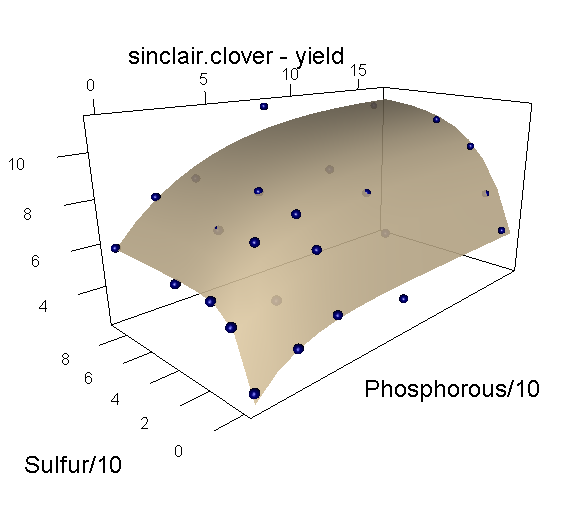

<style type="text/css">
body, td { font-size: 14pt; color: #000; padding:1em; }
code, pre, #ws, #message { font-size: 12pt;
  color: #000; background-color: #f5f5f5; }
code {border: 1px solid #e0e0e0; padding: 0 5px;}
pre > code { border: 0; }
</style>

## Abstract

The `agridat` package is an extensive collection of data sets that have
been previously published in books and journals, primarily from agricultural
experiments.

This vignette presents graphical views of a few of the datasets in this package.

One surprising discovery of this project is that often only 10-20 lines of R code are needed to reproduce the original statistical analyses published in association with the data.

## Setup

```{r setup, results="hide"}
library("knitr")
opts_chunk$set(fig.align="center", fig.width=6, fig.height=6)
options(width=90)
```
This exhibit of agricultural data uses the following packages.

```{r packs, message=FALSE}
library("agridat")
library("desplot")
library("gge")
library("HH")
library("lattice")
library("latticeExtra")
library("mapproj")
library("maps")
library("reshape2")
```

-----

## Potato blight incidence over space and time

```{r lee1, fig.height=7.5}
dat <- lee.potatoblight
# Note the progression to lower scores as time passes in each year
skp <- c(rep(0,10),
         rep(0,7),1,1,1,
         rep(0,8),1,1,
         rep(0,6),1,1,1,1,
         rep(0,5),1,1,1,1,1,
         rep(0,5),1,1,1,1,1,
         rep(0,6),1,1,1,1,
         rep(0,5),1,1,1,1,1,
         rep(0,5),1,1,1,1,1,
         rep(0,5),1,1,1,1,1)
require(desplot)
desplot(y ~ col*row|date, dat,
        main="lee.potatoblight",
        between=list(y=.3), strip.cex =.6,
        layout=c(10,11), skip=as.logical(skp))
```

@lee2009random analyzed a large dataset to evaluate the resistance of
potato varieties to blight.  This data contains evaluations of a changing set
of varieties every two years, evaluated in 5 blocks, repeatedly throughout the
growing season to track the progress of the disease.  Each panel shows a field
map on the given date, with a separate row of panels for each year.

Would you include field spatial trends in a model for these data?

-----

```{r lee2}
# 1983 only.  I.Hardy succumbs quickly
dat <- lee.potatoblight
dat$dd <- as.Date(dat$date)
d83 <- droplevels(subset(dat, year==1983))
foo <- xyplot(y ~ dd|gen, d83, group=rep,
       xlab="Date", ylab="Blight resistance score",
       main="lee.potatoblight 1983", as.table=TRUE,
       par.settings=list(
         superpose.symbol=list(col=c("black","red","royalblue","#009900","dark orange"),
           pch=c("1","2","3","4","5"))),
       scales=list(alternating=FALSE, x=list(rot=90, cex=.7)))
foo + xyplot(y ~ dd|gen, d83, subset=year==1983, type='smooth', col='gray80')
```

In 1983, 20 varieties were evaluated in 5 blocks (shown by colored numbers)
throughout the growing season for disease resistance. Resistance scores start
at 9 for all varieties (shown in panels).  As the growing season progresses,
the 'I.HARDY' variety succumbs quickly to blight, while 'IWA' succumbs
steadily, and '064.1' resists blight until near the end of the season.

Does this view show differences between blocks?

-----

## An informative prior

```{r harrison, fig.height=6}
d1 <- subset(harrison.priors, substance=="daidzein")
d1 <- d1[ , c("source","number","min","max")]
out <- data.frame(source=vector("character"),
                  vals=vector("numeric"))
for(ii in 1:nrow(d1)){
  n <- d1[ii,'number']
  mi <- d1[ii,'min']; ma <- d1[ii,'max']
  mu <- mean(log(c(mi,ma)))
  sig <- (log(mi) - mu ) / qnorm(1/(1+n))
  vals <- exp(mu + sig*qnorm(seq(1/(1+n), to=n/(1+n), length=n)))
  out <- rbind(out, data.frame(source=d1[ii,'source'], vals=vals))
}
out <- droplevels(out) # Extra levels exist in d1
foo0 <- dotplot(source ~ vals, out, main="harrison.priors", xlab="Daidzein level",
                panel=function(x,y,...){
                  panel.dotplot(x,y,...)
                  #browser()
                  # Minimum for each row
                  x2l <- tapply(x, y, min)
                  x2r <- tapply(x, y, max)
                  y2 <- tapply(y, y, "[", 1)
                  panel.xyplot(x2l, y2, pch=16, cex=1.5, col="navy")
                  panel.xyplot(x2r, y2, pch=16, cex=1.5, col="navy")
                },
                # Hack.  Add blanks for extra space on graph
                ylim=c(levels(out$source),"","","","prior","Constructed","",""))

# Now calculate parameters for a common lognormal distribution
mu0 <- mean(log(out$vals))
sd0 <- sd(log(out$vals))
xvals <- seq(0,2000, length=100)
library("latticeExtra")
foo0 + xyplot((19+4000*dlnorm(xvals, mu0, sd0))~xvals, type='l',
              panel=function(x,y,...){
                panel.xyplot(x,y,...)
                panel.abline(h=19, col="gray90")
              })

```

@harrison2012bayesian used a Bayesian approach to model daidzein levels
in soybean samples.  From 18 previous publications, they extracted the
published minimum and maximum daidzein levels, and the number of samples
tested.  Each line in the dotplot shows large, dark dots for one published
minimum and maximum.  The small dots are imputed using a lognormal
distribution.

All observed/imputed data were then used to fit a common lognormal
distribution that can be used as an informative prior.
The common prior is shown by the density at the top of the dotplot.

Do you think it is better to use a non-informative prior, or this informative
prior?

-----

## Data densities for a binomial GLM

```{r mead}
dat <- mead.germination
# dat <- transform(dat, concf=factor(conc))

# Use log conc as a covariate.

# Note, my graph showing the density of the fit is similar to graphs
# found at the following site.  Did I get my idea here?  I don't know.
# http://www.unc.edu/courses/2010fall/ecol/563/001/docs/lectures/lecture18.htm#numerical

dat <- transform(dat, logconc=log(conc+.01))
m6 <- glm(cbind(germ, seeds-germ) ~ temp + temp:logconc, data=dat,
          family=binomial(link="logit"))

# Estimates of p for the binomial densities
newb <- expand.grid(temp=c('T1','T2','T3','T4'), logconc=log(c(0,.1,1,10)+.01))
newb$pct <- predict(m6, new=newb, type='response')
# Binomial density
foob <- xyplot(pct~logconc |temp, newb,
               xlim=c(-5.5, 4.5), ylim=c(-2, 53), as.table=TRUE,
               xlab="Log concentration",
               ylab="Seeds germinating (out of 50).  Binomial density.",
               main="mead.germination", #layout=c(4,1),
               panel=function(x,y,...){
                 for(ix in 1:4){
                   quan <- qbinom(c(.025, .975), size=50, prob=y[ix])
                   yval <- seq(min(quan), max(quan), by=1)
                   off <- x[ix]
                   xl <- off + rep(0, length(yval))
                   # Constant multiuplier of 8 chosen by trial and error
                   xr <- off + 8 * dbinom(yval, size=50, prob=y[ix])
                   panel.segments(xl,yval,xr, yval, cex=.35, lwd=3, col="gray70")
                 }
               })


# Add mean response line with equally-spaced points on the log scale
newl <- expand.grid(temp=c('T1','T2','T3','T4'),
                   logconc=seq(log(.01), log(10.01), length=50))
newl$pct <- predict(m6, new=newl, type='response')
# Logistic curve
fool <- xyplot(pct~logconc|temp, newl,
               panel=function(x,y,...){
                 panel.points(x, 50*y, type='l', col='blue')
               })


# Data points last, on top of everything
food <- xyplot(germ~logconc|temp, dat, layout=c(4,1),
       ylab="Seeds germinating (out of 50)", cex=1.5, pch=20, col='black')
foob + fool + food

```

@mead2002statistical present data for germination of seeds under four
temperatures (T1-T4) and four chemical concentrations.  For each of the 4*4=16
treatments, 50 seeds were tested in each of four reps.  In the graphic, each
point is one rep. The blue line is a fitted curve from a GLM with Temperature
as a factor and log concentration as a covariate.  The gray lines show the
central 95\% of the binomial density at that position.

Does this display help you understand the logit link and changing shape of the
binomial density?

-----

## Verification of experiment layout

```{r gomez}
dat <- gomez.stripsplitplot

# Layout
require(desplot)
desplot(gen~col*row, dat,
        out1=rep, col=nitro, text=planting, cex=1,
        main="gomez.stripsplitplot")
```

@gomez1984statistical provide data for an experiment with 3 reps, 6
genotypes, 3 levels of nitrogen and 2 planting dates.  The experiment layout
is putatively a ''split strip-plot''.  To verify the design, the
`agridat` package contains a function `desplot()` for plotting the
designs of field experiments, which is used in the graphic below.

How is the design different from a ''split-split-plot'' design?

-----

## Visualizing main effects, two-way interactions

```{r gomez2}
dat <- gomez.splitsplit
dat$nitrogen <- factor(dat$nitro)
require(HH)
#position(dat$rep) <- position(dat$management) <-
#  position(dat$gen) <- c(10,70,130)
#position(dat$nitrogen) <- c(0,50,80,110,140)
interaction2wt(yield~rep+nitrogen+management+gen, data=dat,
               main="gomez.splitsplit",
               relation=list(x="free", y="same"),
               rot=c(90,0), xlab="",
               par.strip.text.input=list(cex=.8))
```

@heiberger2004statistical provide an interesting way to use lattice
graphics to visualize the main effects (using boxplots) and interactions
(using interaction plots) in data.  Below, rice yield is plotted
versus replication, nitrogen, management type, and genotype variety.
Box plots show minor differences between reps, increaing yield due to
nitrogen, high yield from intensive management, and large differences between
varieties.

Do you think interaction plots show interaction (lack of parallelism)?

-----

## 3D yield response to fertilizers

\includegraphics[width=0.9\textwidth]{sinclair-clover}



@sinclair1994sulphur examined clover yields as a function of sulfur and
phosphorous fertilizer in a factorial-treatment experiment.
@dodds1996bivariate modeled the yield
response using a Mitzerlisch-like equation that allows interacting curvature
in two dimensions $x$ and $y$:
$$
yield = \alpha * \left( 1 + \beta *\left(\frac{\sigma + \tau*x}{x+1}\right)^y\right) *
\left( 1+\delta*\left(\frac{\theta + \rho *y}{y+1}\right)^x \right)
$$
The blue dots are observed data, and the tan surface is the fitted surface
drawn by the `rgl` package).

How would you decide the optimal fertilizer levels?

-----

## Mosaic plot of potato damage from harvesting

```{r keen, fig.width=7, fig.height=7.5}
dat <- keen.potatodamage

# Energy E1, Rod R4, Weight W1 have higher proportions of severe damage
# Rod 8 has the least damage
d2 <- xtabs(count~energy+rod+gen+weight+damage, data=dat)
mosaicplot(d2, color=c("lemonchiffon1","moccasin","lightsalmon1","indianred"),
           xlab="Energy / Genotype", ylab="Rod / Weight", main="keen.potatodamage",
           off=c(3,10,10,8,0),border="gray50")

```
@keen1997analysis looked at damage to potatoes caused by lifting rods
during harvest. In this experiment, eight
types of lifting rods were compared.  Two energy levels, six
genotypes and three weight classes were used.
For each combinations of treatments, about 20 potato tubers were rated as
undamaged (D1, yellow) to severely damaged (D4, red).  Counts per treatment
are shown in a mosaic plot.

Which style of lifting rods cause the least/most damage to potatoes?

-----

## Yield vs covariate for lattice::barley

```{r wright}
dat <- minnesota.barley.yield
datw <- minnesota.barley.weather

# Weather trends over time
library("latticeExtra")
#useOuterStrips(xyplot(cdd~mo|year*site, datw, groups=year,
#main="minnesota.barley", xlab="month", ylab="Cooling degree days",
#subset=(mo > 3 & mo < 10), scales=list(alternating=FALSE),
#type='l', auto.key=list(columns=5)))

# Total cooling/heating/precip in Apr-Aug for each site/yr
ww <- subset(datw, mo>=4 & mo<=8)
ww <- aggregate(cbind(cdd,hdd,precip)~site+year, data=ww, sum)

# Average yield per each site/env
yy <- aggregate(yield~site+year, dat, mean)

minn <- merge(ww, yy)


# Higher yields generally associated with cooler temps, more precip
library("reshape2")
me <- melt(minn, id.var=c('site','year'))
mey <- subset(me, variable=="yield")
mey <- mey[,c('site','year','value')]
names(mey) <- c('site','year','y')
mec <- subset(me, variable!="yield")
names(mec) <- c('site','year','covar','x')
mecy <- merge(mec, mey)
mecy$yr <- factor(mecy$year)
oldpar <- tpg <- trellis.par.get()
tpg$superpose.symbol$pch <- substring(levels(mecy$yr),4) # Last digit of year
trellis.par.set(tpg)
foo <- xyplot(y~x|covar*site, data=mecy, groups=yr, cex=1, ylim=c(5,65),
              xlab="Weather covariate", ylab="Barley yield",
              main="minnesota.barley",
              panel=function(x,y,...) {
                panel.lmline(x,y,..., col="gray")
                panel.superpose(x,y,...)
              },
              scales=list(x=list(relation="free")))
foo <- useOuterStrips(foo, strip.left = strip.custom(par.strip.text=list(cex=.7)))
combineLimits(foo, margin.x=2L)
```

@wright2013revisiting investigated the `lattice::barley` data.
The original two years of data were extended to 10 years (from original source
documents), and supplemented with weather covariates for the 6 locations and
10 years.  Each panel shows a scatterplot and regression for average location
yield verses the
weather covariate.  Horizontal strips are for locations, vertical strips are
for covariates: cdd = Cooling Degree Days, hdd = Heating Degree Days,
precip = Precipitation).  Higher values of heating imply cooler weather.
Each plotting symbol is the last digit of the year (1927-1936) for that
location.

Does barley yield better in cooler or warmer weather?

-----

## GGE biplot

```{r crossa, message=FALSE}

# Specify env.group as column in data frame
dat2 <- crossa.wheat
dat2$eg <- ifelse(is.element(dat2$loc,
c("KN","NB","PA","BJ","IL","TC", "JM","PI","AS","ID","SC","SS",
"SJ","MS","MG","MM")), "Grp1", "Grp2")
require(gge)
m4 <- gge(yield~gen*loc, dat2, env.group=eg, scale=FALSE)
# plot(m4)
biplot(m4, lab.env=TRUE, title="crossa.wheat")
```

@laffont2013genotype developed a variation of the GGE (genotype plus
genotype-by-environment) biplot to include auxiliary information about a
block/group of environments.  In the example below, each location is
classified into one of two mega-environments (colored).  The mosaic plots
partition variation simultaneously by principal component axis and source
(genotype, genotype-by-block, residual).

Which genotypes are best to each mega-environment?

-----

## Nebraska farming income choropleth

```{r nebr1}
library("maps")
library("mapproj")
library("latticeExtra")

dat <- nebraska.farmincome
dat$stco <- paste0('nebraska,', dat$county)
dat <- transform(dat, crop=crop/1000, animal=animal/1000)

# Raw, county-wide incomes.  Note the outlier Cuming county
redblue <- colorRampPalette(c("firebrick", "lightgray", "#375997"))
mapplot(stco ~ crop + animal, data = dat,
        scales = list(draw = FALSE),
        main="nebraska.farmincome",
        xlab="", ylab="Income ($1000) per county",
        colramp=redblue,
        map = map('county', 'nebraska', plot = FALSE, fill = TRUE,
                  projection = "mercator"))

```

The Red-Blue palette in the `RColorBrewer` package is a divergent palette
with light colors near the middle of the scale.  This can cause problems when
there are missing values, which appear as white (technically, the background).
In order to increase the visibility of missing values, the `agridat`
package uses a Red-Gray-Blue palette, with a gray color that is dark enough to
clearly distinguish missing values.

How does the outlier county (Butler) in northeast Nebraska limit interpration of
spatial patterns in the data?

-----

```{r nebr2}

# Now scale to income/mile^2
dat <- transform(dat, crop.rate=crop/area, animal.rate=animal/area)
# And use manual breakpoints.
mapplot(stco ~ crop.rate + animal.rate, data = dat,
        scales = list(draw = FALSE),
        main="nebraska.farmincome",
        xlab="", ylab="Income ($1000) per square mile (percentile breaks)",
        map = map('county', 'nebraska', plot = FALSE, fill = TRUE,
                  projection = "mercator"),
        colramp=redblue,
        #breaks=quantile(c(dat$crop.rate, dat$animal.rate),
        #                c(0,.1,.2,.4,.6,.8,.9,1), na.rm=TRUE)
        # To eliminate dependency on classInt package, hardcode the breakpoints
        #breaks=classIntervals(na.omit(c(dat$crop.rate, dat$animal.rate)), n=7, style='fisher')$brks
        breaks=c(0,.049, .108, .178, .230, .519, .958, 1.31)
        )
```

Because counties are different sizes, the second graphic uses an income rate
per square mile.  Because of the outlier, it might be smart to use percentile
break points, but doing so hides the outlier.  Instead, the break points are
calulated using a method called Fisher-Jenks.
These break points show both the outlier and the spatial patterns.
It is now easy to see that
northwest (Sandhills) Nebraska has low farming income, especially for crops.
Counties with missing data are white, which is easily distinguished from gray.

Where are farm incomes highest?  Why?

-----

## Las Rosas yield monitor

```{r lasrosas,fig.height=7.5}

dat <- lasrosas.corn
library("latticeExtra")

# yield map
redblue <- colorRampPalette(c("firebrick", "lightgray", "#375997"))
foo1 <- levelplot(yield ~ long*lat|factor(year), data=dat,
          aspect=1, layout=c(2,1),
          main="lasrosas.corn grain yield (qu/ha)", xlab="Longitude", ylab="Latitude",
          scales=list(alternating=FALSE),
          prepanel = prepanel.default.xyplot,
          panel = panel.levelplot.points,
          type = c("p", "g"), col.regions=redblue)

# Experiment design...shows problems in 2001
dat <- lasrosas.corn

xl <- range(dat$long)
yl <- range(dat$lat)

sseq=matrix(c(
  35, 0.9, 0.5,  # brown
  35, 0.8, 0.6,
  35, 0.7, 0.7,
  35, 0.6, 0.8,
  35, 0.5, .9,
  35, 0.4, 1,
  80, 0.9, 0.5,  # green
  80, 0.8, 0.6,
  80, 0.7, 0.7,
  80, 0.6, 0.8,
  80, 0.5, 0.9,
  80, 0.4, 1,
  190, 0.9, 0.5,  # blue
  190, 0.8, 0.6,
  190, 0.7, 0.7,
  190, 0.6, 0.8,
  190, 0.5, 0.9,
  190, 0.4, 1
  ), ncol=3, byrow=TRUE)
sseq <- hsv(sseq[,1]/360, sseq[,2], sseq[,3])

dat$repnf <- factor(paste(dat$rep,dat$nf))
# levels(dat$repnf) # check the order
#dat <- transform(dat, col=as.character(sseq[as.numeric(factor(paste(dat$rep,dat$nf)))]))

# By default, manual specification of col/pch does not work with multiple panels.
# Define a custom panel function to make it work
mypanel <- function(x,y,...,subscripts,col,pch) {
  panel.xyplot(x,y,col=col[subscripts],pch=pch[subscripts], ...)
}

foo2 <- xyplot(lat~long|factor(year), data=dat,
               aspect=1, layout=c(2,1),
               xlim=xl, ylim=yl, cex=0.9,
               main="lasrosas.corn experiment design", xlab="", ylab="",
               scales=list(alternating=FALSE),
               col=sseq[dat$repnf],
               #pch=levels(dat$topo)[dat$topo],
               pch=c('-','+','/','\\')[dat$topo],
               panel=mypanel)

plot(foo1, split = c(1, 1, 1, 2))
plot(foo2, split = c(1, 2, 1, 2), newpage = FALSE)

```

@anselin2004spatial and @lambert2004comparison looked at yield monitor data
collected from a corn field in Argentina in 1999 and 2001, to see how yield
was affected by field topography and nitrogen fertilizer.  The figures below
show heatmaps for the yield each year, and also the experiment design (colors
are reps, shades of color are nitrogen level, plotting character is
topography).

Which year showed greater spatial variation in yield?

-----

## Time series of corn yields by state

```{r nass, fig.height=8}
dat <- nass.corn
dat$acres <- dat$acres/1000000

# Use only states that grew at least 100K acres of corn in 2011
keep <- droplevels(subset(dat, year == 2011 & acres > .1))$state
dat <- subset(dat, state != "Delaware")
dat <- subset(dat, state != "Idaho")
dat <- subset(dat, state != "Washington")
dat <- subset(dat, state != "California")
dat <- droplevels(subset(dat, is.element(state, keep)))
# Acres of corn grown each year
xyplot(acres ~ year|state, dat, type='l', as.table=TRUE,
       layout=c(6,5),
       strip=strip.custom(par.strip.text=list(cex=.5)),
       main="nass.corn", xlab="Year", ylab="Million acres of corn")

```

The National Agricultural Statistics Service tracks the total number of acres
planted to corn (and other crops) for each state in the U.S.  The plot below
shows large changes over the past century in corn acreage for selected states.

Which states were in the corn belt in 1925?
Which states were in the corn belt in 2000?

-----

## Session information
```{r session}
sessionInfo()
```

## References
